# Expense Tracker
Expense Tracker is a web application for managing personal expenses. Users can add, edit, delete, and filter expenses, while the data is stored in a PostgreSQL database.

## How to run

1. Open the project in VS Code.
2. Open the terminal and go to the backend folder:
cd backend
3. Install the required packages:
 npm install
4. Make sure the PostgreSQL database expense_tracker is available.
5. If the expenses table does not exist, open schema.sql in pgAdmin and run it.
6. Create a .env file inside the backend folder:
DB_USER=postgres
DB_HOST=localhost
DB_NAME=expense_tracker
DB_PASSWORD=your_password
DB_PORT=5433
PORT=3000

Note: PostgreSQL is running on port 5433 in my setup.

7. Start the backend:
node server.js
8. Open frontend/index.html in VS Code.
9. Right-click index.html and select Open with Live Server.
10. The Expense Tracker application will open in the browser.

### Backend

1. Open the project in VS Code.
2. Open the terminal and go to the backend folder:
   ```bash
   cd backend
   ```
3. Install the required packages:
   ```bash
   npm install
   ```
4. Create a PostgreSQL database named:
   ```text
   expense_tracker
   ```
5. Open the `expense_tracker` database in pgAdmin and run the `schema.sql` file to create the `expenses` table and insert the sample data.
6. Create a `.env` file inside the `backend` folder:
   ```env
   DB_USER=postgres
   DB_HOST=localhost
   DB_NAME=expense_tracker
   DB_PASSWORD=your_password
   DB_PORT=5433
   PORT=3000
   ```
   Replace `your_password` with your PostgreSQL password. 
   If PostgreSQL uses a different port, use that port instead.

7. Start the backend:
   ```bash
   node server.js
   ```
8. The backend will run on:
   ```
   http://localhost:3000
   ```


**Frontend**

Open frontend/index.html in VS Code.
Use the Live Server extension to open the page in the browser.
Make sure the backend is running before using the application.

## Features

1. Add an expense with validation
2. Delete an expense
3. Edit an expense
4. Filter by category
5. Search by title
6. Summary cards (total, count, highest)
7. Data is saved in a PostgreSQL database
8. Dark mode
9. Expenses by category chart
10. Loading spinner
11. Error messages when the server is unavailable
12. Responsive design for mobile screens
13. Hover effect on table rows
14. Hover effect on summary cards.


## What was the hardest part?

The hardest part for me was connecting the backend with the PostgreSQL database and understanding how pgAdmin works with the project. At first, I had some problems with the connection, but I kept trying until I got it working and understood how everything connects together,I used AI to understand the problem and kept trying to solve it.


## Screenshots


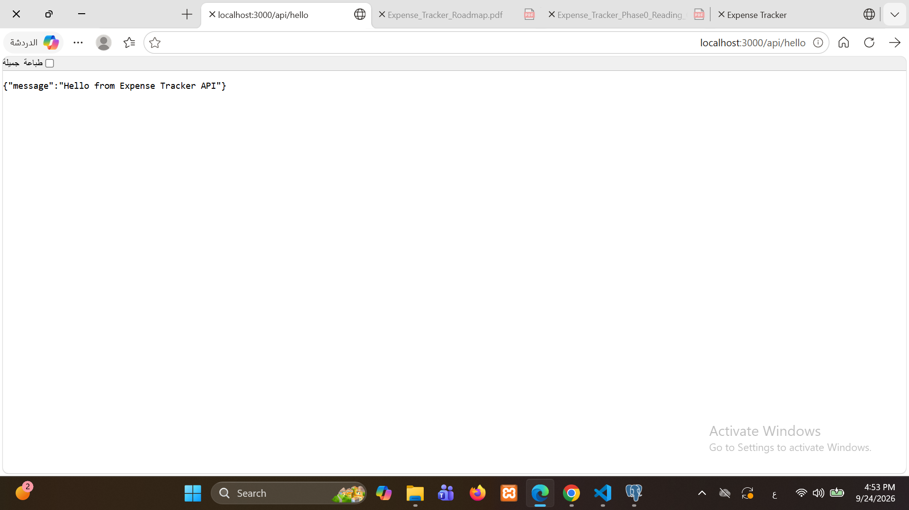
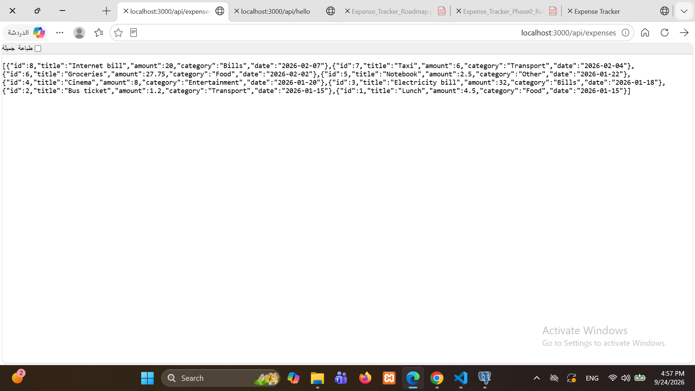
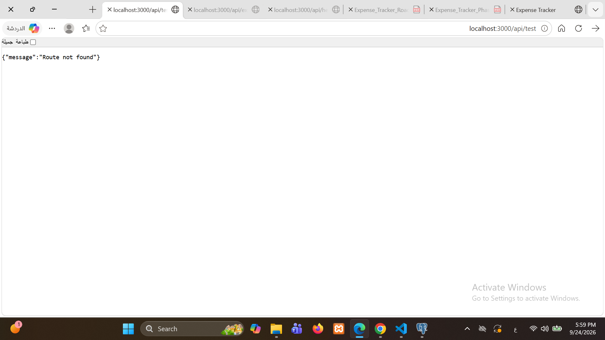
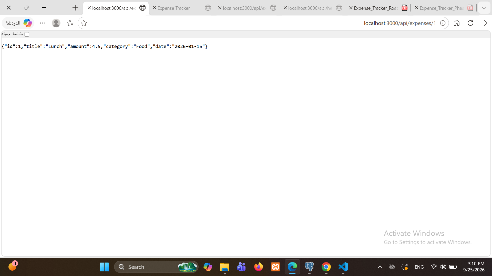
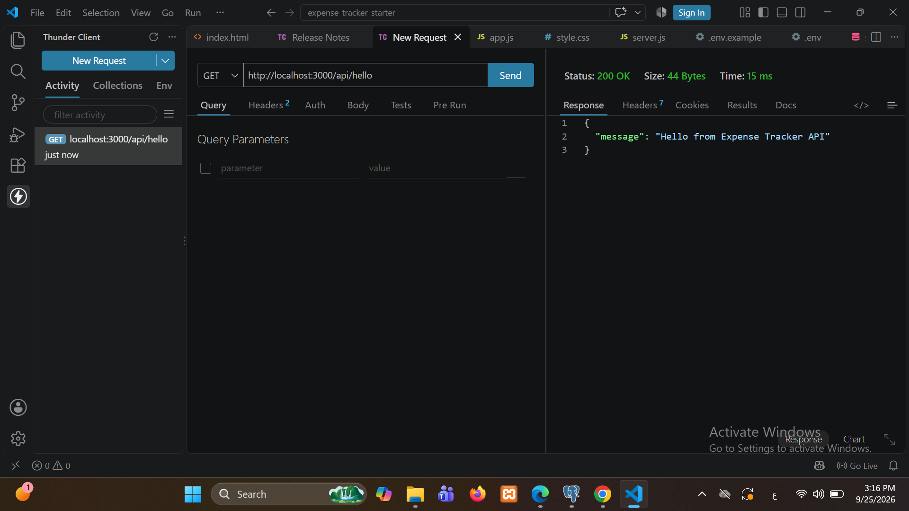
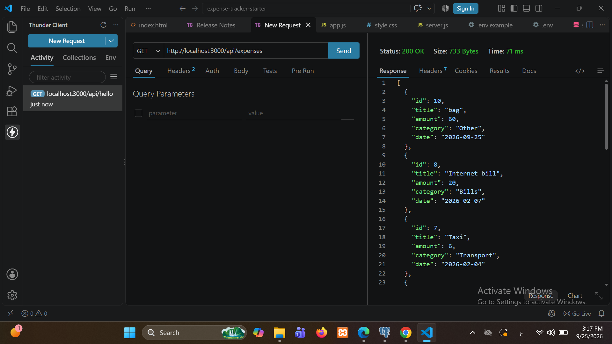
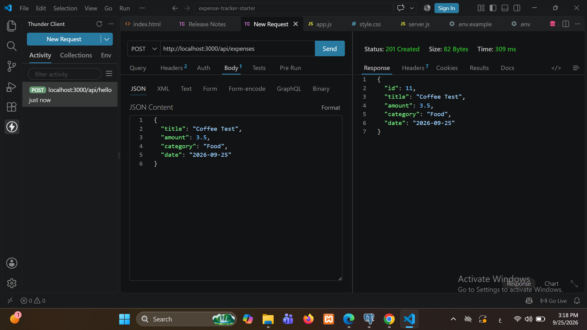
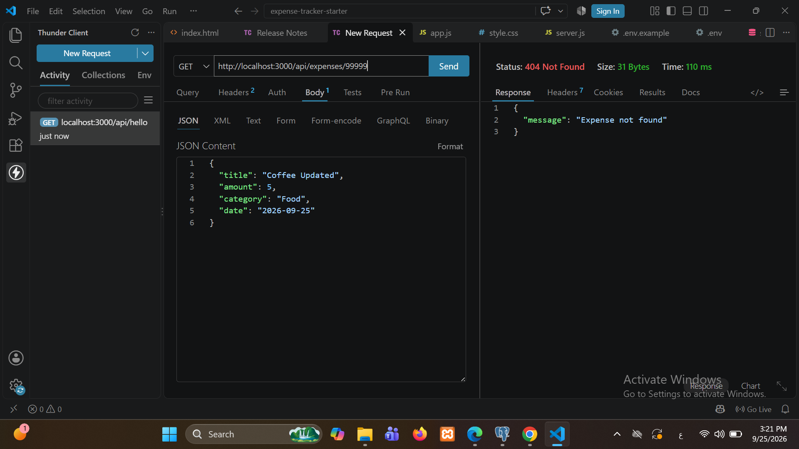
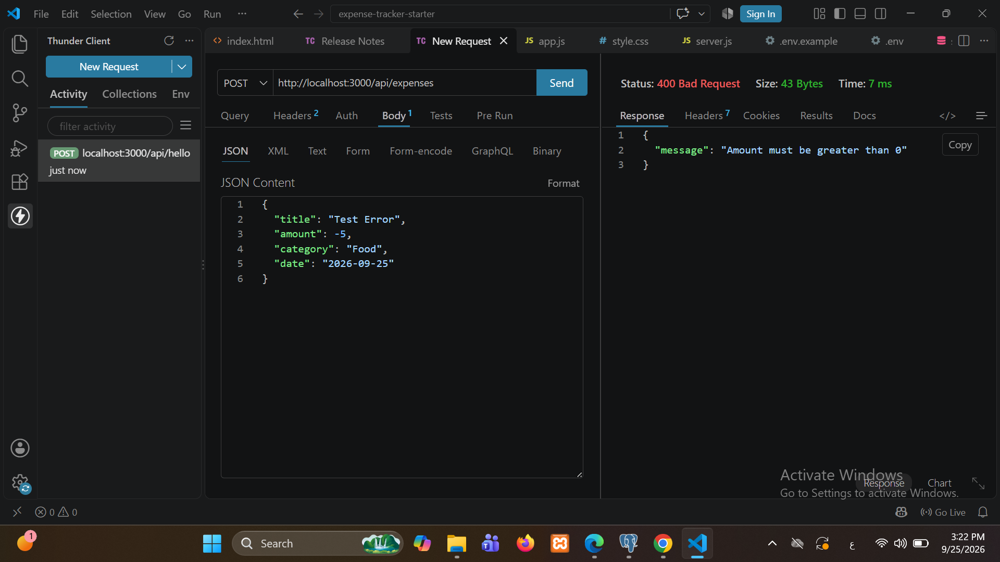
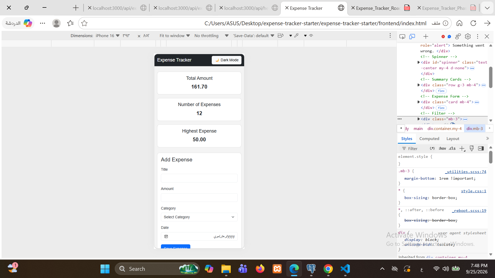
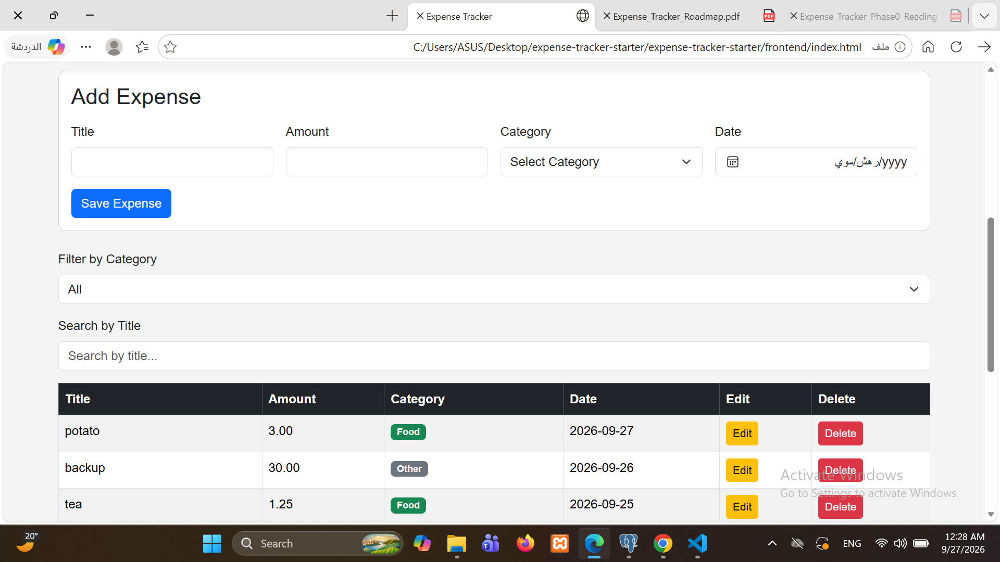
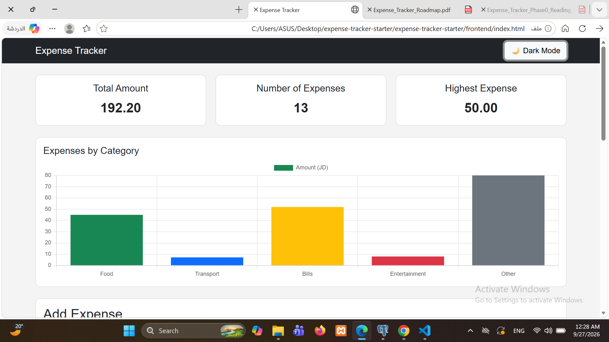

## Project Demo Video

[Watch the project demo](https://docs.google.com/videos/d/1U9-Ho45kEtmOCR7PhBhzw3N05uNpS2x8jkWIU0RT7IA/edit?usp=drive_link)

